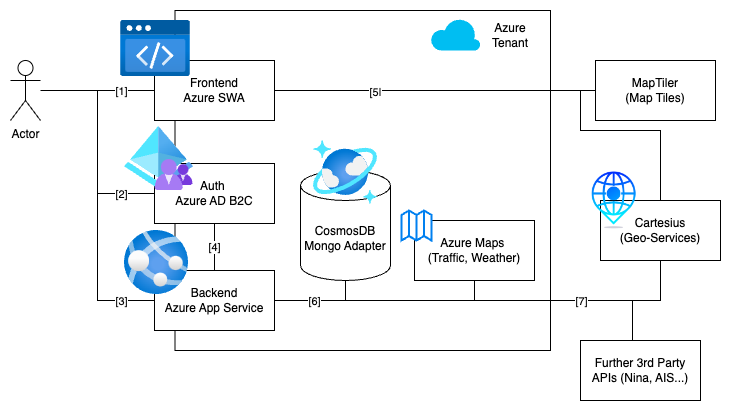

# Kordis Landscape

The following diagram shows the high-level architecture components that Kordis
is built on.

[1]: Frontend _SPA_ being served with Azure SWA.  
[2]: User-Auth Flow managed by Azure AD.  
[3]: Backend _API_ being served with Azure Web Apps (App Services).  
[4]: Token Storage/ User Management  
[5]: Frontend connects to MapTiler for Vector Maps and Cartesius for Geocoding
Services.  
[6]: Backend connects to Database and further services such as Azure Maps and
Cartesius.  
[7]: Backend also consumes 3rd Party Services such as the
[NINA API](https://nina.api.bund.dev/).
